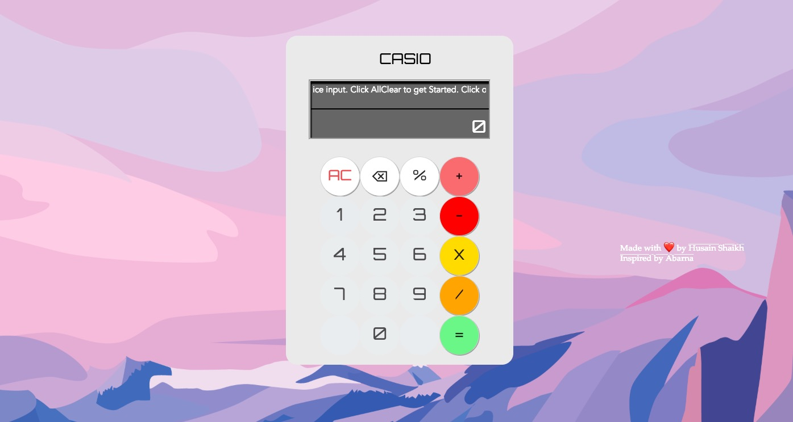

# Calculator-GUI
Graphical calculator using HTML, CSS and JS.

- Screenshot

# Added Feature : Voice Input
Steps:
1. Click on the CASIO Logo to initialise recording
2. Your Browser might ask you to allow permisiion for microphone access, Click on Allow. If it doesn't then go to step 4
3. Say the Number Clearly followed by operator and then again another Number
4. Wait for a couple of seconds, The input and result will be printed on the Console of virtual Calculator

**A few Examples :**
5 multiply 6

2 plus 102

3 minus 1

100 multiply 10

20 percent 3

20 remainder 6, etc.

# Credits :
Special credit to [Abarna](https://github.com/abarna-codespot)
